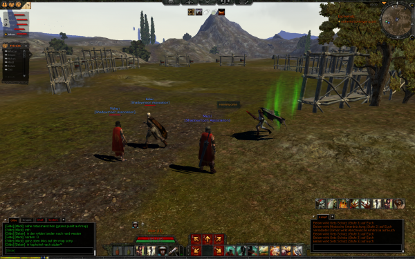
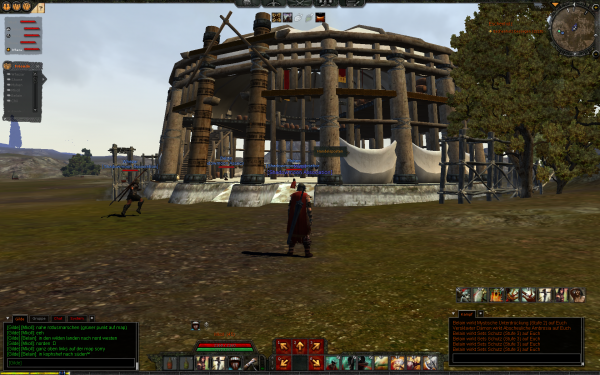

Tach :D

Hab hier noch ein paar Screenshots ausgebuddelt aus der Aoc Anfangszeit. Die Screenshots wurden aufgenommen am 03.06.2008 ... also 10 Tage nach Release hatten wir bereits den Markt erfarmt. :p

Bild 1:

Bild 2:

Die Animation erinnert übriegens stark an Siedler 2 :P
