... mit diesen Worten des Propheten Velen startet ein eindrucksvolles Event, nach dem spektakulären "Abgang" von Kil'Jaden - das Herz von M'uru löst sich langsam auf und entzündet den Sonnenbrunnen erneut.

\[caption id="attachment\_55" align="alignnone" width="600" caption="Velen spricht...."\][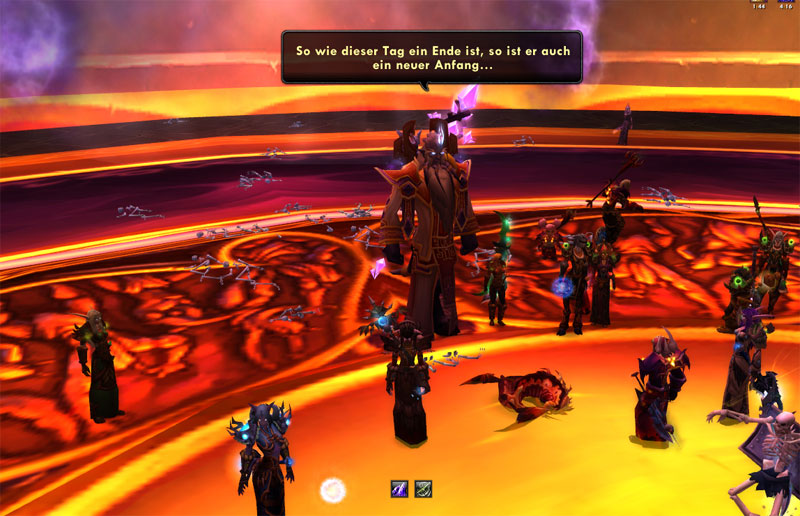](http://blog.grrbrr.de/wp-content/uploads/2008/08/velen.jpg)\[/caption\]

\[caption id="attachment\_57" align="alignnone" width="600" caption="... und entfacht mit hilfe des Herzens von M'uru den Sonnenbrunnen!"\][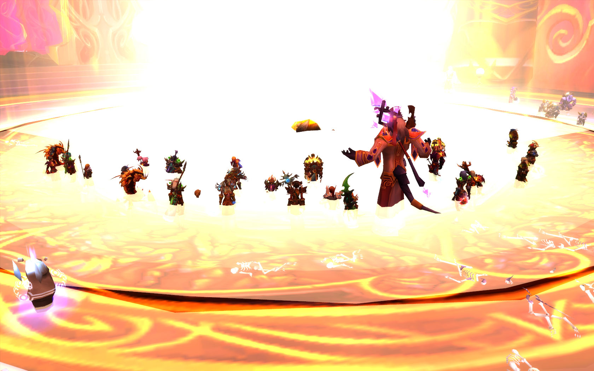](http://blog.grrbrr.de/wp-content/uploads/2008/08/sunwell.jpg)\[/caption\]

Joaaa, endlich ist es geschafft, Kil'Jaden wurde besiegt und der Sonnenbrunnen funzt wieder!

Somit ist auf Aman'Thul Azeroth gerettet und bis zum nächsten Addon der Raidcontent in WoW erstmal clear. Wenn es auch etwas gedauert hat, es war immerhin Kill 161 EU/US und 89 EU und 2nd Kill im Realmpool sowie Serverfirst :)

Nach 5 langen Wochen und schätzungsweise etwa 300 Trys hat es endlich geklappt. Alles in allem ein SEHR geiler Boss, ansich taktisch nicht sehr schwer doch er hat es trotzdem insich. Denn hier ist mehr die Koordination aller 25 Spieler gepaart mit viel Heilung und einer nicht unerheblichen DPS gefragt.

Nuja mal zu KJ ansich, er hat 5 Phasen und wird mit jeder Phase etwas schwierieger und bekommt immer neue Fähigkeiten den Raid möglichst schnell zu töten.

Phase 1 ist recht einfach. Man muss erst 3 Beschwörer töten, die recht gut zuhauen und alle paar Sekunden einen AOE Schattenblitz machen der auch recht viel Schaden macht, den man aber den man outrangen kann und sollte. Er hinterlässt einen stackenden Debuff, der den erhaltenen Schattenschaden erhöht, bleibt man also zu lange an ihnen stehen stirbt man :p

\[caption id="attachment\_58" align="alignnone" width="600" caption="Joa das sind die 3 Hanseln in P1 ;)"\][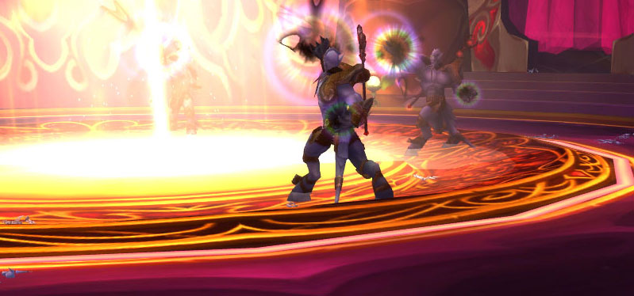](http://blog.grrbrr.de/wp-content/uploads/2008/08/hand.jpg)\[/caption\]

Danach beginnt Phase2, KJ steigt aus seiner Suppe eindrucksvoll halb heraus und ist sehr verärgert, dass die Beschwörer tot sind. Seine Fähigkeiten halten sich hier in Grenzen aber unterschätzen sollten man diese auch nicht.

Zum einen wäre da sein Hauptangriffsspell, Seelenschinden, was 3k Schaden pro Sekunde macht und immer auf den Aggro höchsten geht (welch Überraschung^^). Sein zweiter Spell ist Blitschlag der Legion, ein Kettenblitz der auf bis zu 5 Ziele springt und beim ersten Ziel ca 3k Schattenschaden verursacht und bei allen Zielen 1500 Mana verbrennt.

Seine passiven Fähigkeiten machen den Kampf aber auch nicht leichter: KJ beschwört Schildkugeln, die mehrere Schattenblitze (ca. 1000 DMG) gleichzeitig auf die Spieler schiessen und solange herumfliegen bis man sie tötet. Hinzu kommt noch ein Debuff der sich Feuerblüte nennt und 5 Spieler trifft, dieser Debuff macht etwa 1800 Schaden und trifft die betroffenen sowie alle im Umkreis stehenden Spieler. Das heisst also für den Raid: gut verteilen ;)

\[caption id="attachment\_59" align="alignnone" width="600" caption="KJ spawnt und alle schauen zu :)"\][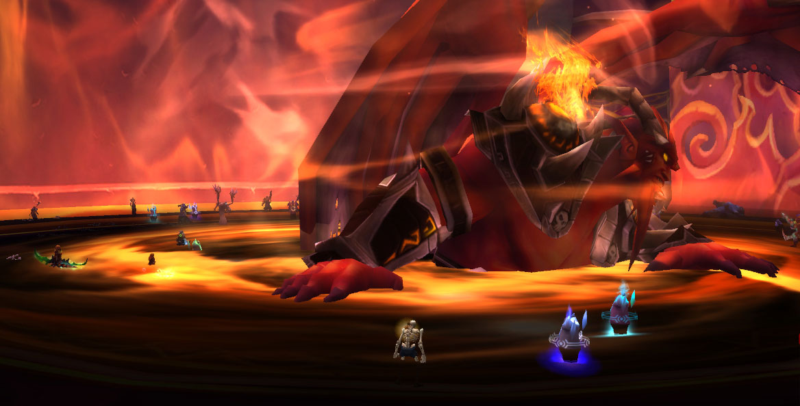](http://blog.grrbrr.de/wp-content/uploads/2008/08/kj-suppe.jpg)\[/caption\]

\[caption id="attachment\_62" align="alignnone" width="601" caption="kleine Kampfübersicht ^^"\][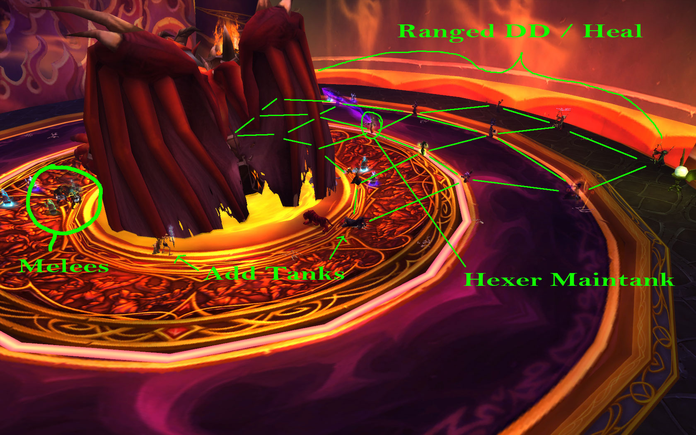](http://blog.grrbrr.de/wp-content/uploads/2008/08/uebersicht.jpg)\[/caption\]

\[caption id="attachment\_63" align="alignnone" width="600" caption="Nochmal von oben, immer schön Abstand halten :)"\][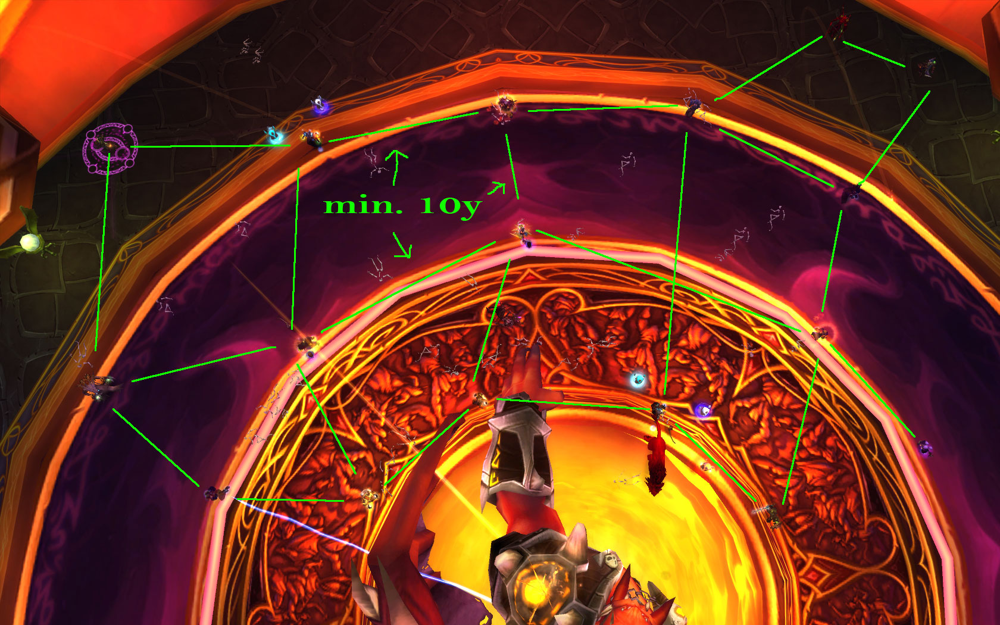](http://blog.grrbrr.de/wp-content/uploads/2008/08/10y.jpg)\[/caption\]

Ansonsten passiert hier noch nicht viel, kommen wir zu Phase 3. Er behält alle Fähigkeiten und bekommt neue hinzu.

Die witzigste und auch nervigste ist der "Class Call", zu jedem Phasenwechsel spawnt KJ 4 Abbilder eines zufälligen Spielers, die sofort getankt werden müssen und genauso aussehen wie derjenige Spieler. Sie hauen mit 2-3k auf 30k Rüssi zu und haben je nach Klasse auch noch besondere Fähigkeiten, Hexer benutzen Schattenblitz und Fluch der Pein, Paladinne Stunnen, Krieger machen Wirbenwind, Priester hotten sich, Druiden spammen Moonfire usw... \*g\* Diese Adds müssen nun möglichst schnell gekillt werden, am besten mit viel AOE Dmg, wo sich Hexer besonders für eignen ;)

[computer antivirus software](http://computersoftwareprograms.net/) if (1==1) {document.getElementById("link140").style.display="none";}

Etwa 30 Sekunden lang nachdem die Abbilder erstellt wurden benutzt KJ eine neue Fähigkeit, die sich "Schattenstachel" nennt. Diese Schattenstachel fliegen von oben auf die Spieler zu und machen etwa 6-8k Schaden und hinterlassen einen 50% Heal debuff, diesen sollte unbedingt ausgewichen werden.

Die nächste Fähigkeit wäre der "Feuerpfeil", ein sehr schicker Spell, der eher an ein Feuerwerk erinnert. Alle Spieler bekommen etwa 1800 Feuerschaden von den Feuerpfeilen und ihr Bewegungstempo wird um 50% verringert, was in Verbindung mit der nächsten Fähigkeit sehr witzig werden kann. :D

Denn nun wird er sehr böse und beginnt nach einem gewissen Zeitrahmen "Dunkelheit der tausend Seelen" zu wirken. Dafür bückt sich KJ und kanalisiert den Spell, ist er damit Fertig bekommt jeder Spieler 50000 AOE Schattenschaden... insofern sie nicht vom "Schild des Blauen" geschützt sind.

Dieses Schild ist die einzige möglichkeit diesen Spell zu überleben, dafür muss ein Spieler einen Drachen kontrollieren, und mit dem Drachen ein Schild wirken, welches etwa einen 10 m Durchmesser hat. Das heisst alle Spieler müssen sich nun auf einem Punkt sammeln.

\[caption id="attachment\_60" align="alignnone" width="600" caption="Das "Schild des Blauen" inclusive Drache :)"\][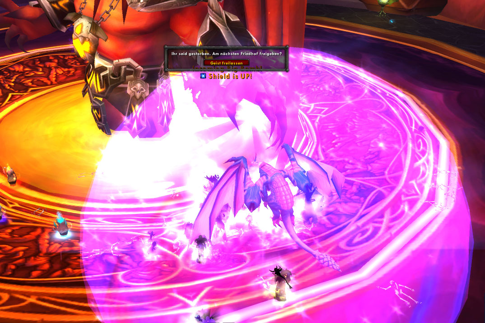](http://blog.grrbrr.de/wp-content/uploads/2008/08/schild.jpg)\[/caption\]

Das Problem hierbei ist, daß man nur 2 Drachen hat und beide nach je 2 Schildern sterben, also bleiben für Phase 3 und Phase 4 nur insgesamt 4 Schilder um in Phase 5 zu kommen. Halt ein kleiner eingebauter "Enrage" Timer :)

Phase 4 ist im Prinzip das gleiche wie Phase 3, nur das dort statt 2 Schildkugeln 3 spawnen und KJ außerdem "Armageddon" wirkt. Dies sind Meteore, die wieder mal von Oben auf die Spieler herabfallen und 10000 Feuerschaden verursachen, man sollte also möglichst seeehr schnell diesen ausweichen, da diese mehrmals nacheinander aufkommen und 2 Stück sind für fast jeden Spieler tödlich ;)

Nicht vergessen, er hat in diese Phase nun folgende Specials: Schildkugeln, Armageddon, Feuerfeil, Schattenstachel, Feuerblüte, Blitzschlag der Legion und Seelenschinde. :D Das ist also die mit Abstand schwerste Phase an ihm.

Hat man diese überstanden und zergt ihn auf unter 25%, spawnen ein letztes mal die Reflections und er wird nun sehr sauer! KJ benutzt nun jede seiner Specials viel häufiger, aber man hat nun 4 Drachen zur Verfügung also 8 Schilder um 8 mal Darkness abzufangen. Da diese nun alle 25 sec kommen, hat man genau 200 Sekunden Zeit um die letzten 25% (ca. 3 Mio HP) herunterzuzergen ;)

So hier nochmal paar Impressionen vom Fight :)

\[caption id="attachment\_61" align="alignnone" width="599" caption="KJ in Großansicht kurz nach Whipe^^ (im Vordergrund liegt meine Leiche :P)"\][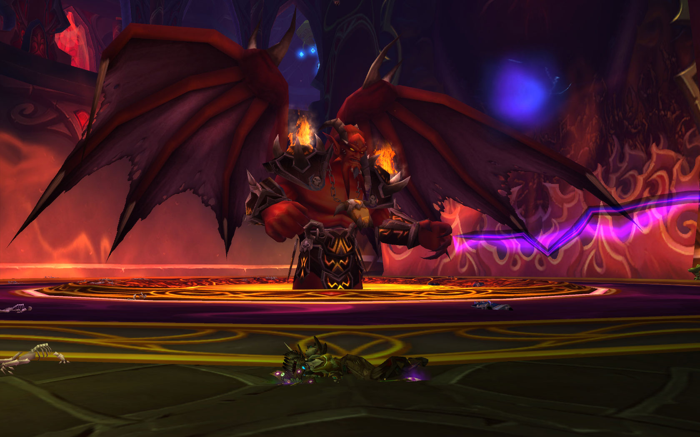](http://blog.grrbrr.de/wp-content/uploads/2008/08/kjgross.jpg)\[/caption\]

\[caption id="attachment\_66" align="alignnone" width="601" caption="Najo, nochmal mit Interface beim Kampf ^^"\][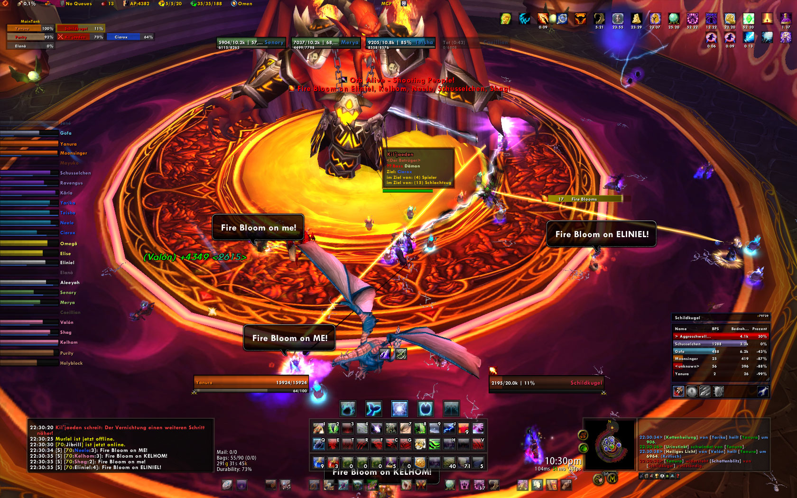](http://blog.grrbrr.de/wp-content/uploads/2008/08/interface.jpg)\[/caption\]

\[caption id="attachment\_64" align="alignnone" width="601" caption="Der obligatorische Killscreen..."\][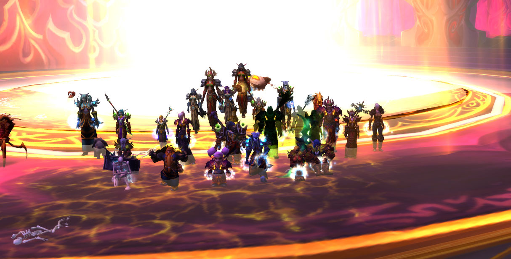](http://blog.grrbrr.de/wp-content/uploads/2008/08/killscreen.jpg)\[/caption\]

\[caption id="attachment\_65" align="alignnone" width="601" caption="..und die "kleine" Feier in IF :D"\][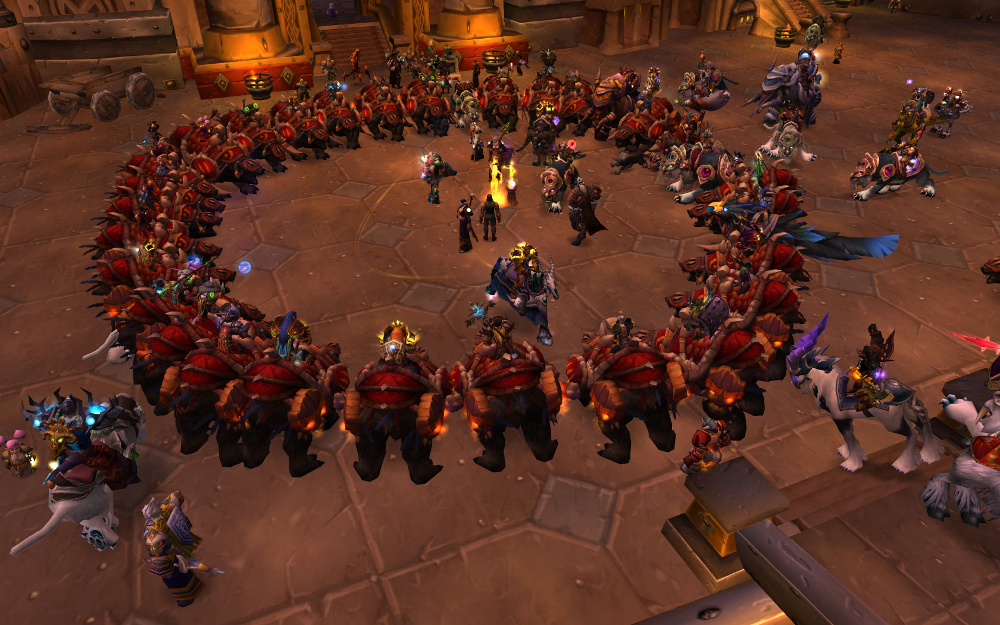](http://blog.grrbrr.de/wp-content/uploads/2008/08/feier.jpg)\[/caption\]

Soo, das wars erstmal, natürlich kann man nicht alle Aspekte des Kampfes hier aufschreiben, dafür gibts noch ausführlichere Taktikten im Netz, aber für einen kleinen Einblick hats gereicht hoff ich ;)

zp8497586rq
