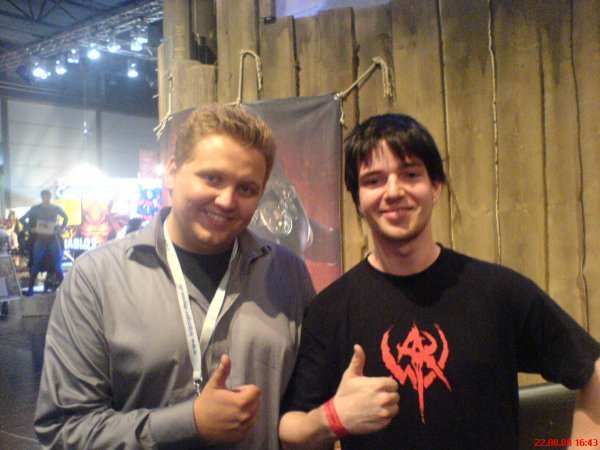
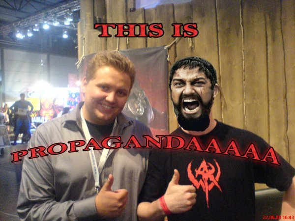

Jo,

ich hab mir mal so gedacht, fährste mal zur Games Convention 2008 und guckst mal was da so läuft. Natürlich hab ich auch dem Funcomstand einen Besuch erstattet und will euch davon erzählen ;)

Als erstes schnappte ich mir einen Staffmitarbeiter mit den Worten: "Du hast doch bestimmt Ahnung!" wodrauf dieser mit "Allerdings" antwortete ... Hmm joo war das nun überheblich oder nicht? Im laufe des Gesprächs stellte er sich als durchaus Kompetent dar und erläuterte mir genau warum Age of Conan momentan noch Kinderkrankheiten hat. Im laufe des Gespräches Erfuhr ich zum Beispiel das er im offiziellen Forum als 'Wiesel' unterwegs ist. Nach dem durchweg positiven Gespräch mit 'Wiesel' und einigem Feedback, hatte ich ein durchaus positiven Gesamtblick auf Funcom und Age of Conan. Er schlug außerdem vor um 17 Uhr an einer Präsentation teilzunehmen.

Nun denn ... um 16:40 Uhr schlugen ich und Freund Stefan wieder beim Funcom stand auf um uns gute Plätze für die Show zu sichern ... und Lol wen seh ich da? Erling Ellingson ... ihr wisst schon ... [der kleine rote Bär aus dem Video](http://blog.grrbrr.de/?p=3) ... richtig der Propagandaaa Minister von Funcom ;-)

Ich fragte ihn ob ich ein Foto mit ihm machen könne ... und naja seht selbst:

Tjo, da bin ich nun mit Erling Ellingson .... und meinem überaus coolen Warhammer online T-Shirt \*lol\* Naja wie dem auch sei hab ich ihm nach dem Foto auch noch mal über den tollen Endgame Content erzählt den ich momentan erlebe ... "Cutting wood" sagte ich nur.

Nach kurzem hin und her fragte er mich doch ernsthaft ob ich nicht lust hätte auf eine interne Präsentation die eigentlich nur für Presse ist. Ich sagte natürlich sofort zu und Stefan durfte auch mit :-) Das war echt der Hammer, wir sind in den Funcomstand rein und hinter die Theke in einen abgetrennten raum. Dort durften wir uns dann nen Stuhl aussuchen und eine halbnackte Kurtisane im AoC verschnitt brachte uns Schnittchen und Getränke :-) (Kurz darauf hat Erling uns Bier angeboten aber shit, ich hatte schon ein Wasser bei der Dame bestellt :))

Die Präsentation war ziemlich cool und hat viele einblicke auf kommenden PvE so wie PvP Inhalt geboten. Außerdem ließ Erling verlauten das in der Tat ein Addon IN PLANUNG! ist, dies aber noch eine ganze weile dauern wird.

Nunja, das war wirklich das Highlight der GC 08 für mich, der Propagander Minister hat also sein Werk vollbracht ;) Und wisst ihr was meine Guildmates dazu sagen?

Tja ... Propagandaaaaaaaaaaa sagen die ;)

So long!
