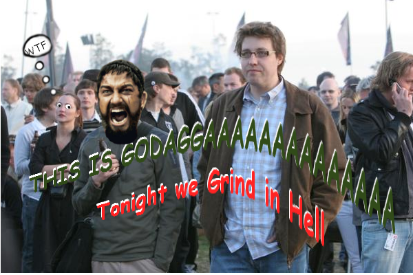

Wer ihn noch nicht kennt, dies ist er König Gaute unter Fachkreisen auch einfach "Gaute Bär" genannt. Nunja dies ist der Herr der uns dieses tolle Spiel Age of Conan beschert hat und ich muss sagen er hat ganze Arbeit geleistet. Age of Conan ist seit dem Anarchy Online Addon: The Shadowlands das beste Spiel was dieser Herr verstümpert hat. Natürlich hatte er da auch so seine Probleme denn Visual Basic lernt sich halt nich von aleine ([Insider](http://blog.grrbrr.de/?p=3 "Ein Tag bei Funcom")) ... nunja wenigsten ist es noch released worden und nicht so wie Duke Nukem: Fornever in der Versenkung verschwunden. Nunja wir müssen aber alle Gaute ziemlich danken denn dank ihm habe ich gelernt: Never buy a game on release und desswegen sage ich laut und zurecht

_**Danke für alles mein lieber Gaute**_

PS: Lernen durch Schmerz :(
