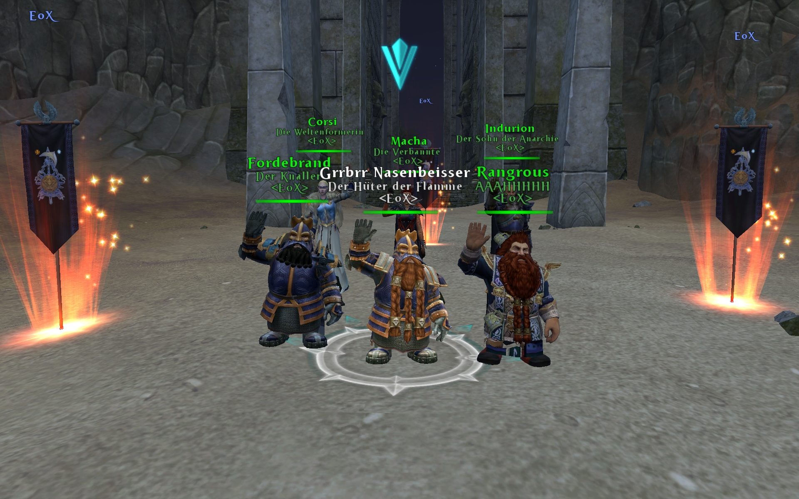
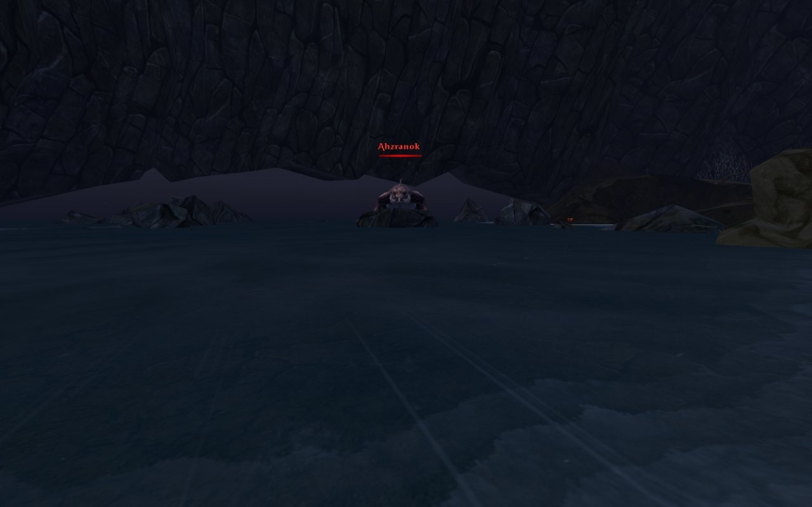
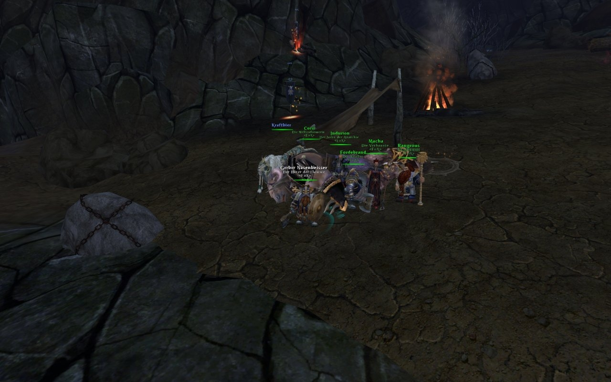
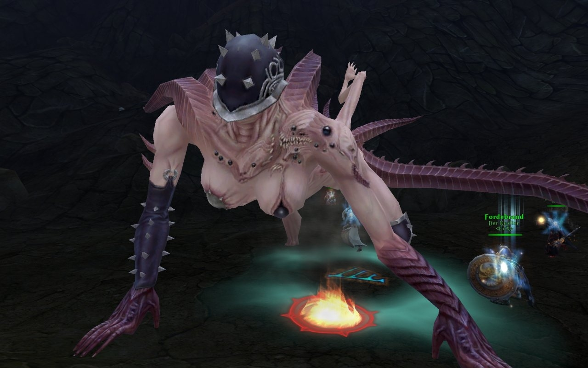
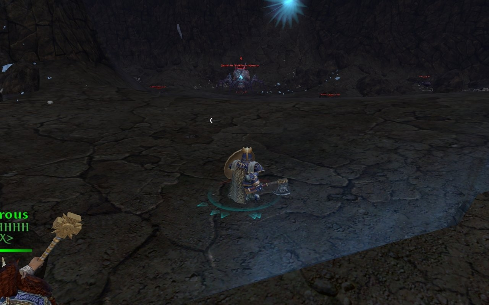

Hallo,

Vergangenen Sonntag  war ich mit meiner Stammgruppe das erste mal richtig Aktiv in Lost Vale unterwegs und ich möchte euch von meinen Eindrücken erzählen.

## Der Weg zum ersten Wing-Boss:

Auf dem Weg zum Wing-Boss "Dralel die Weißfeuer-Matrone" begegneten uns 3 Side-Bosse und viele Tiermenschen die wir töten müssten. Die Tiermenschen bestehen aus Castern sowie Melee DD. Ich stellte fest, das die Caster einen Debuff haben der die Ausführungszeit aller Fähigkeiten um 2 Sekunden erhöht. Dies ist extrem nervig und stört zum Teil auch beim Aggro halten. Wir erklärten die Caster kurzer Hand zu den Primärzielen jeder Mobgruppe.

Während des gesamten Flügels spawnen hinter euch immer wieder Patroullien von 1 bis 3 Tiermenschen die dann gemütlich den ganzen Flügel ablaufen bis Sie euch gefunden haben. Als Eisenbrecher musste ich somit auch oft ein Auge auf die Pat´s haben, die unserer Gruppe das Leben erschwerten. Bei Boss-Fights ist ein Off-Tank für störende Patroullien Gold wert :-) Interessant sind außerdem die Kristalle die überall herumstehen. Diese sollten von der Gruppe aufgesammelt werden, sie werden später für ein Quest benötigt.

**Ahzranok** Ahzranok ist der erste Side-Boss auf den wir trafen. Er gehört zu den einfachen Bossen im linken Flügel und er besitzt wenig Fähigkeiten vor denen man wirklich Angst haben sollte. In regelmäßigen Abständen erhöhrt er seine Rüstung wodurch er anschließend weniger Dmg erhält. Außerdem spawnt er im Low HP bereich ziemlich viele kleine Echsen die aus den umherliegenden Eiern schlüpfen. Bei den Echsen handelt es sich um normale Mobs die sehr schnell im AE Dmg sterben. Sinnvoll ist hier wenn beide Tanks ihren AE Spot bereit halten bis die Echsen spawnen und dann möglichst viel auf einen Punkt zusammen ziehen.

Eine Besonderheit hat dieser Boss allerdings - Seid ihr zu langsam mit dem töten wird nach dem Tod Ahzranok´s ein weiterer Boss spawnen der schwieriger ist als Ahzranok selbst. Dieser besitzt eine böse DMG reflect Aura die er in gewissen Zeitabständen aktiviert, mit guter Heilung ist es aber im Grunde keine echte Herausforderung. Gebt einfach ein wenig Gummi mit dem Dmg, dann erspart ihr euch einen zweiten Boss.

Der erste kill brachte uns folgende Items die wir beide Entwertet haben: [Ahzranok's Pavise](http://www.wardb.com/item.aspx?id=640201) und [Darkpromise Rifle](http://www.wardb.com/item.aspx?id=421124)

**Malghor** Auf dem Weg zum zweiten Side-Boss, dem stinkendem Tiermensch "Malghor", gibt es eigentlich keine Besonderheiten. Auch hier trafen wir erneut auf Gruppen von Tiermenschen bei denen wir die Caster erneut priorisierten. Zu diesem Zeitpunkt war unser super Sigi Indurion im Team-Speak schon am Rumheulen wegen den immer wiederkehrenden Patrouillen. Nun denn...

Als wird den Boss erreichten wussten wir noch nicht was uns erwartet, ich kann euch nur sagen das es für mich als Tank eine extreme Herausforderung war diesen Boss zu legen. Meiner Meinung nach ist das der erste wirklich richtig schwere Boss in meiner Warhammer Zeit. Malgor stinkt nicht nur tierisch nach Schweiß und Ziegenkot - Nein er hat auch wirklich fiese Tricks auf lager. Er spawnt wärend des Kampfes ständig neue, lila Wolken auf den Boden. Hüpft in diese Wolken jemand hinein so erhält dieser a) sofort Aggro vom Boss b) einen Debuff der sehr hoch (unendlich?) stackt, durch den man mit jeder stack Stufe mehr schaden erhält

Nach diversen whipes und einem hilfreichen Hinweis durch Ceowolfx was die optimale Stellung der Gruppe betrifft, hatten wir einen sehr erfolgreichen Versuch. Wir schafften es den Boss soweit herunter zu haun das er im User-Interface bereits als "Dead" angezeigt wurde :-) Leider hat der stinker mich mit seinen Lebenspunkten noch aus den Latschen gehauen und die ganze Gruppe gewhiepd ... Fuck ;)

Die Gruppe hat sich anschließend neu gesammelt und nach einem super konzentrierten durchlauf haben wir es ENDLICH geschafft zu obsiegen. Ich schaffte es ohne zwischen durch zu sterben den Boss zu tanken und ALLE wolken bis auf eine einizge zu umlaufen. Ich habe es also geschafft wärend des ganzen Kampfs den Boss permanent rückwerts durch die Wolken zu manövrieren - Vielleicht hilft diese Info einmal einem anderem Tank.

In nachfolgendem Screenshot ist im Hintergrund eine Standarte zu erkennen. Dort oben auf der Schräge stand unser komplettes Team während des Kampfes, denn dort spawnen in der Regel keine Wolken und unser off Tank konnte sich dort um die Patroullien kümmern. Sollte es doch einmal passieren das ein Melee DD in eine Wolke kommt und dadurch Boss Aggro zieht, würde ich mit meinem Brecher sofort in die nächste Wolke springen. Unser Feuermagier "Macha" erhielt einen [Darkpromise Emberstaff](http://www.wardb.com/item.aspx?id=421115), den anderen Loot habe ich vergessen.

> Update: Nach mehreren Lost Vale runs ist uns dieser Boss viel leichter gefallen. Wir haben ihn an der selben Stelle getankt wie bereits geschrieben, allerdings haben wir uns das evaden von den Wolken gespart und den Boss via Tank & Spank gekillt :-) Wenn es den Heilern nicht mehr möglich war den stätig ansteigenden Dmg zu heilen, hat einfach der 2te Tank in der Gruppe für kurze Zeit übernommen.

**Horgulul** Der dritte und letzte Side-Boss ist eine Chaosbestie und meiner Meinung nach ein Witz im Gegensatz zu Malghor besitzt Horgulul nicht das recht sich "Side-Boss" zu schimpfen. Er gleicht eher einer Truhe auf die man einschlägt bis sie sich öffnet um den Loot zu erhalten. Kurz: Tank & spank.

Horgulul bestitzt einen Area-Knockback wodurch es sich für den Main-Tank empfiehlt mit dem Rücken zum Felsen in der Mitte zu stehen. Immer wenn Horgulul diesen Knockback benutzt spawnt er außerdem mehrere Maden. Sie machen nicht viel Dmg und ein Area-Taunt vom Offtank reicht hier aus um die Maden vernünftig im AE Dmg sterben zu lassen. Horgulul hinterließ uns nach seinem ab leben [Darkpromise Vambracers](http://www.wardb.com/item.aspx?id=421057), die wir leider entwerten mussten. Außerdem konnten wir hier ein Quest abschließen indem wir die gesammelten Kristalle auf den Fels in der Mitte anwendeten.

**Dralel die Weißfeuer-Matrone** Nun waren wir endlich angekommen beim Wing-Boss "Dralel". Dralel ist eine riesige Spinne und kein Held/in, sondern Kommandant/in. Leider haben wir es aus Zeitgründen nicht mehr geschafft Dralel an diesem Sonntag zu besiegen - Allerdings werden wir dies Mittwoch nachholen und ich werde diesen Artikel dann aktualisieren. Für ein Screenshot hat die Zeit dann aber dennoch gelangt.

Wie versprochen hier nun die Ergänzung. Wir haben es nun also geschafft vergangenen Mittwoch Dralel zu töten. Wir haben ein paar whipes gebraucht um die optimale Stellung zum Tanken herauszufinden. Diese befindet sich unserer Meinung nach in der unteren rechten Ecke das Raumes. Ich habe die Spinne mit dem Rücken zur Wand an dem Lichtstrahl getankt.

Während des fights spawnen laufend neue kleine Spinnen die zu Dralel laufen um mit ihr zu fusionieren. Dies gilt es zu verhindern, da jede erfolgreiche Fussion den Dmg von Dralel um 1% erhöht. Die oben genannte Stellung zeichnet sich vorallem dadurch aus, das die Spinnen mehr oder weniger in einer Linie zu Dralel laufen. Dies erleichterte es unseren DD´lern Corsi und Macha die Spinnen früh genug zu töten.

## Hilfreiches

Nachfolgende Wälzer-Taktik finde ich hilfreich für diesen Wing. Ersetzt die 0% bitte durch 5%, der Wardb-Eintrag ist nicht ganz richtig. [Favour of the Mad](http://www.wardb.com/spell.aspx?id=15114) Falls ihr euch für die Taktik näher interessiert, [kann ich euch diesen Link empfehlen](http://moneyne.ws/2008/09/28/warhammer-online-tome-tactics-guide/#chaotic).

Grüße an Rangrous, Corsi, Fordebrand, Indurion und Macha

Bis dann, GrrBrr

[Zu Teil 2](http://blog.grrbrr.de/2009/03/erlebnisse-eines-eisenbrecher%c2%b4s-heute-lost-vale-teil-2/ "Teil 2")
