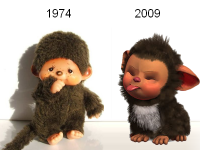

Moin!

<table cellspacing="5"><tbody><tr><td valign="top"></td><td>Da ich seit neustem ISDN habe, jedoch noch kein ISDN-Telefon besaß, musste ich gestern zwangsweise zu Media-Markt und mir eins kaufen. Da ich schonmal dort war, habe ich mir gleich das PlayStation EyePet gekauft, die Werbung im TV fand ich schon immer lustig. :)

Als ich mich dann mit meiner Freundin vor den TV gesetzt habe, war das erste was sie sagte "OHhhh süß, Monchichi" ... Hä? :D Ich muss sagen sie hat ziemlich recht</td></tr></tbody></table>

Man kann sich das Spiel im Prinzip als Tamagotchi für die Ps3 vorstellen. Meiner Freundin hat es Spaß gemacht, ich fand es nach 15 Minuten langweilig :p

Zu allem Überfluss habe ich im Internet noch den Monchichi Song gefunden: [Monchichi Song bei YouTube](http://www.youtube.com/watch?v=tHJ19nkXhlU)

Besonders bei dem Refrain erkennt man, wie Stone die Leute in den 80igern wirklich waren.

> Kuschel muschel kusch kuschel kuschel musch musch ... Oh wie Kuschelmuschel wunderschön

Wenn man den weiteren Textverlauf höhrt, fragt man sich ernsthaft ob die kleinen Kuschelaffen nicht auch ab und zu als Dildo missbraucht wurden.

> Au nicht so doll ... JA so ist´s toll

So long, Nico
