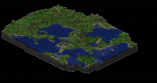
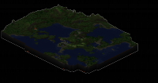

Hi,

momentan spiele ich mit ein paar Freunden das Spiel Minecraft. Wer es nicht kennt sollte unbedingt mal googlen ;) Bringt echt Spaß.

Auf der gemeinsamen Server Welt spielen wir nun seit ca einer Woche und es hat sich viel getan.

<table border="0"><tbody><tr><td>Ansicht bei Tag</td><td>Ansicht bei Nacht</td></tr><tr><td></td><td></td></tr></tbody></table>

(klicken, um Bild zu vergrößern)

### Verbaute Blöcke

Air: 31376660 Stone: 28094510 Grass: 276553 Dirt: 3097223 Snow: 0

Water: 1021694 Ice: 0 Lava: 185588

Obisidian: 1891

Trunk: 9710 Leaves: 106393 Wood: 863 Cactus: 12

Sand: 231133 Gravel: 879325 Clay: 276

Gold Ore: 14114 Iron Ore: 134149 Coal Ore: 297874 Diamond Ore: 5767 Redstone: 46722

Cobble: 12665 Glass: 99 Cloth: 0 Gold: 0 Iron: 0 Diamond: 0

Farmland: 1 Crops: 0 Reed: 57 Torch: 1165 CraftTable: 13 Chest: 96 Furnace: 24 Wooden Doors: 18 Iron Doors: 0 Signs: 6 Ladder: 242 Railtracks: 80 Wooden Stairs: 0 Rock Stairs: 125 Lever: 0 Buttons: 0 Pressure Plates: 0 Redstone Powder: 0 Redstone Torches: 2
