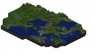
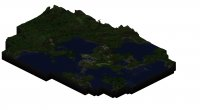

Hi,

da gestern ein Freund von mir meinte er muss gefühlte 24 Stunden am Stück Minecraft spielen, gibt es heute bereits ein neues Bild der Welt :-) Es hat sich viel getan; So entstand z. B. der Hafen Hamburg und ein Elbtunnel der von der Stadt bis zur dem Ufer reicht wo die Lava aus dem Fels entspringt. Außerdem wurde das Projekt Dunkelwald gestartet.

Mittlerweile musste ich die Bilder auch komprimieren, niemand will 5mb Bilder im Browser laden :-)

<table border="0"><tbody><tr><td>Ansicht bei Tag</td><td>Ansicht bei Nacht</td></tr><tr><td></td><td></td></tr></tbody></table>

(klicken, um Bild zu vergrößern)
