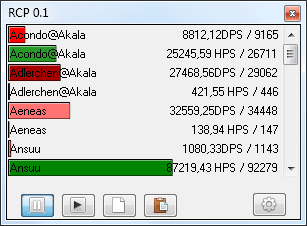

Moin, ich habe am Wochenende ein Tool von mir veröffentlicht: den Rift Combat Parser.

Es ist ein kleines Tool, das eine Logdatei von dem Spiel [RIFT](http://riftgame.com) ausließt und grafisch aufbereitet.

Ich habe für das Tool eine extra Website erstellt, um alle Informationen und Downloads zusammen zu tragen: [http://rift-dps.de.vu](http://rift-dps.de.vu) (Seite existiert nicht mehr)

Der Launch lief ganz ok, in den offiziellen RIFT-Foren gab es bereits ein paar nette Anregungen, so wie konstruktive Kritik und Fragen. Am meisten beschäftigt die deutsche Community sich mit der Frage: Ist ein solches Programm im Sinne der Trion Nutzerbedingung überhaupt legal? Um die vielen Hobbyjuristen zu beruhigen, habe ich heute den Community-Manager um Antwort gebeten... Mal schauen, was dabei rumkommt :)

Ansonsten freue ich mich das ein kleiner Personenkreis das Programm genießen kann und freue mich bis dato über mehr als 200 Downloads der ersten Version. Ich werde noch weitere features implementieren und auf die Wünsche der Community eingehen und somit hoffentlich noch mehr Leute zur Nutzung meines Tools zu bewegen.

Grüße
