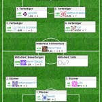
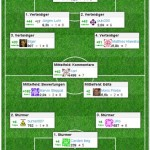

Seit längerem bin ich Abonnent der Zeitschrift [dotnetpro](http://www.dotnetpro.de/). Der Herausgeber dieser Zeitschrifft betreibt auch die Website [codekicker.de](http://codekicker.de) - Eine Art Stackoverflow mit den Schwerpunkten .Net, Java, Mobile und Web. Auf der Website werden jeden Monat fleißige Mitglieder in der sogenannten Codekicker-Elf (Bild links) aufgeführt. Diesen Monat habe ich es geschafft in dieser Liste aufgeführt zu werden :-)

> **Zitat**
> 
> puls200, Matthias Hlawatsch, Nicolai Schönberg und Karl bilden diesen Monat das Abwehrbollwerk in der codekicker.de-Elf des Monats. Mit unermüdlicher Zweikampfstärke haben Sie im abgelaufenen Monat **die meisten Fragen beantwortet** und dafür gesorgt, dass hinten die 0 steht. Unerlässlich für ein erfolgreiches Team.

 

**Update**

Heute morgen habe ich gesehen, das ich es sogar an die Spitze geschafft habe. Endlich genug gespamt um mal oben zu stehen :-)

> Nicolai Schönberg hat im letzten Monat die **meisten Reputationspunkte** gesammelt. Mit vielen Antworten hinten dicht gehalten und trotzdem mit eigenen Fragen und Kommentaren für schnelles Umschalten in den Angriff gesorgt gesorgt. Er ist damit unser Oliver Kahn, der Kapitän und Titan des Codings. Glückwunsch!
