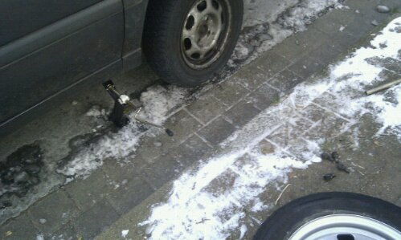

Heute hatte ich ein kleines Problem ... mein rechter Vorderreifen war mit mal platt. - Fail :\\

Gut das ich ein Ersatzreifen im Kofferraum habe dachte ich mir - Win :)

Leider habe ich 30 Minuten an diesem bescheuerten Rad gerüttelt und versucht das kaputte Rad ab zu kriegen ... Ging aber nicht. Jemand hat mir dann einen Hammer geliehen und ich hab solange auf die Felge eingeschlagen bis es endlich ab ging und ich mein Reifen drauf ziehen konnte - Fail? Win? Dunno...

